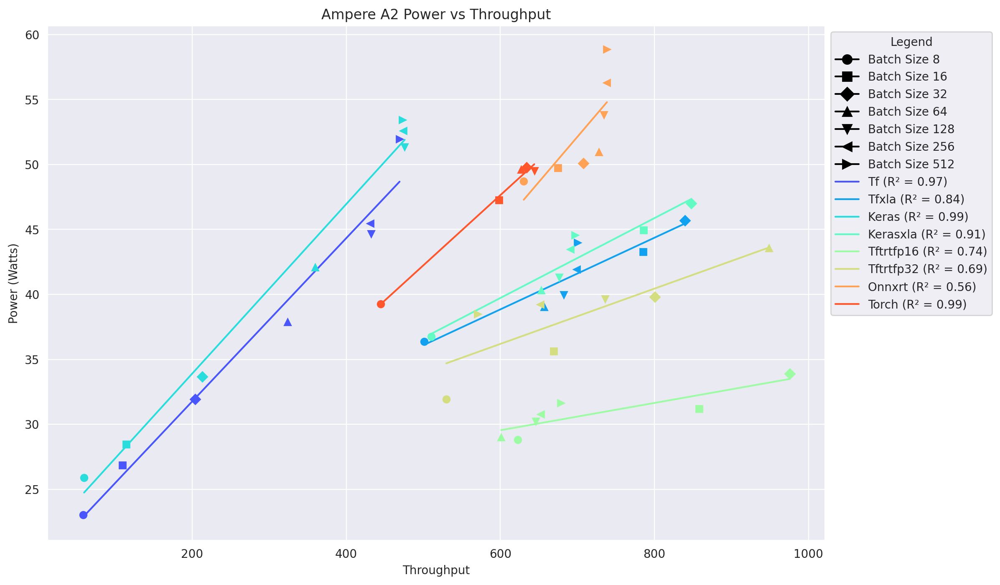
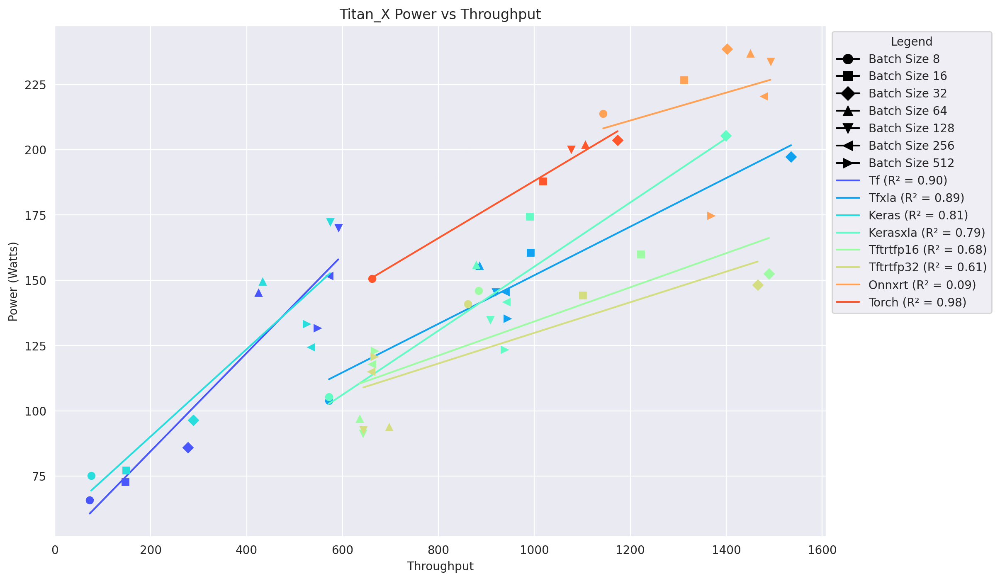

# Benchmarking Inference Frameworks
- This project is an indepth evaluation of deep learning based inference frameworks namely: `tensorrt, onnxrt, torch, keras, kerasxla, tf, tfxla`
- For inference pre-trained MobileNetV3L model was used, where inference was performed with 3 GPUs, above mentioned frameworks and our inference pic
   - 
- Benchmarking was performed on the following 3 machines:
   - Machine 1 is a Nvidia A2, Ampere GPU containing 1280 Cuda cores running at 1440 MHz, 40 Tensor cores and 16G DDR6 of GPU memory also known as VRAM of GPU. This card was launched in November 2021, and has a Thermal Design Power (TDP) of 60 watts, which means the card can handle about 60W of heat dissipation. It has a compute capability of 8.6, bandwidth of 200.1 GB/s and memory bus with width of 128 bit
   - Machine 2 is a Nvidia Tesla V100 PCIe, containing 5120 Cuda cores running at 1230 MHz, 640 Tensor cores and 32G HBM2 of GPU memory. This card was launched in March 2018, and has a TDP of 250 watts. It has a compute capability of 7.0, bandwidth of 897 GB/s and memory bus width of 4096 bit
   - Machine 3 is a Nvidia Titan X Pascal containing 3580 Cuda cores running at 1417 MHz, no Tensor cores and 12G GDDR5X GPU memory. This card was launched in August 2016 and has a TDP of 250 watts. It has a compute capability of 6.1, bandwidth of 480.4 GB/s and memory bus width of 384 bit
- Within the project, throuhput, latency, power consumption of the frameworks was benchmarked. Also an extensive comparison between frameworks was done. All the indepth analysis can be read from the `Final_Analysis.pdf` results and discussion section.

## Setting Up The Project
- If you have a linux system make sure to properly setup CUDA. I used CUDA-12.0 for the project.
- For setting up cuda on either linux or WSL, instructions from [CUDA-SETUP](https://fahimfba.github.io/CUDA-WSL2-Ubuntu/#/?id=step-9-nvidia-cuda-toolkit) can be followed
- Clone the Git Repo
- Install Micromamba
- Create a Mamba environment
   - `mamba create -p ./venv/ -f environment.yml`
- Activate the environment
   - `mamba activate -p ./venv/`
- Install the libraries
   - `pip install -r requirements.txt`
- Copy the envtemplate to .env file
   - `cp env_template .env`
   - Make sure the CUDA versions i.e X and Y are correctly set for CUDA_HOME and XLA_FLAGS variable. Usually cuda path is `/usr/local/cuda-X.Y` for example in CUDA-12.0 X is 12, Y is 0
   - Currently EMA(Energy Measurment Application library) is in beta testing, however you can use it, by copying the EMA.zip contents to `/usr/local/`
   - Set PYTHONPATH=<EMA_dir>/python:<present_working_dir>
   - Set LD_LIBRARY_PATH="<EMA_dir>/lib"
- Export the .env args: `export $(xargs<.env) from the cloned directory`

## Benchmarking Frameworks
- In this project we ran MobileNetV3L tf computer vision model inference, by using different inference frameworks and a [baby elephant pic](https://i.pinimg.com/originals/56/ea/2b/56ea2bb991a7446776ac2f2f27fdc397.jpg).
   - To alter/add more models one can edit the builders_preprocs() function in `create_tf_and_keras_modes.py` file.
   - Frameworks Used to Inference: `tensorrt, onnxrt, torch, keras, kerasxla, tf, tfxla`
- Create a model
   - `python py_scripts/create_tf_and_keras_modes.py`
- Benchmark TF and Keras Models, if you have a multiple gpus use the required gpu-id 0, 1, 2 etc, else 0 works for single gpu's
   - `python py_scripts/benchmark_tf_keras_normal_xla_models.py --gpu-id <num>`
- Benchmark TF and Keras Models XLA
   - `python py_scripts/benchmark_tf_keras_normal_xla_models.py --xla-enabled --gpu-id <num>`
- Benchmark Onnx Models
   - `python py_scripts/onnx_benchmark_models.py --gpu-id <num>`
- Benchmark Pytorch Models
   - `python py_scripts/pytorch_benchmark_models.py --gpu-id <num>`
- Benchmark TRT Models
   - `python py_scripts/trt_benchmark_models.py --gpu-id <num>`

- For the initial options regarding gpu and jupyter notebook(jnb) questions in scripts enter 0 and 0.
- All the throughput and benchmarks will be saved in `benchmark_results/<model_name>/work`
   - The files are named as <framework>_<num_of_iterations>_it_work_py.csv
- All EMA files are stored with <pid> name in current working directory.
   - Rename the files as follows for different frameworks:
      - onnxrt: `onnxrt_py.csv`
      - tf and keras (both frameworks throughputs are captured in one run): `tf_keras_py.csv`
      - tf and keras xla: `tf_keras_xla_py.csv`
      - torch: `torch_py.csv`
      - tensorrt (fp16 and fp32 precision throughputs are captured in one run): `trt_py.csv`

## Generate Plots
- Open the Plot_Generator Nb: `Single_GPU_Plot_Generation.ipynb`
   - Run only the Py titled cells
   - **NOTE** If the plots are inverted, make the invert argument to False in the plotting function call from the nb.
      - It seems to be an issue of matplotlib library, which might be resolved in future updates or so.
   - From my analysis, there is some difference in thrpt and latencies, if the scripts are run via jupyter nbs, namely:
      `TF_Keras_Normal_XLAJnb_benchmarking.ipynb` `TRT_Onnxrt_Torch_benchmarking.ipynb`
      - If these nb's are run, then jnb plots can be generated via jnb cells in the Plot generation nb.

## Side Notes
- Benchmarking was done on: `Nvidia Ampere A2, Nvidia V100, Nvidia Titan RTX`, results are stored in `benchmark_results_final`
   - For these Multiple_GPU_Plot_Generation.ipynb nb was used, to generate combined plots for comparing GPUs
   - Currently there is no automated way, to run on different GPU's together without modifying the code a little.
      - It will be modified in the next iteration if feasible.
      - **For time being one can easily generate plots for benchmarks run on a single machine**
   - Analysis of the results is written in `Final_Analysis.pdf` and analysis tables are present in `benchmark_results_final/Internship.xlsx`

- For testing scripts last run was done on NVIDIA RTX 3090 TI on wsl machine.
   - Results are stored in `benchmark_results` folder.
   - Analysis n Interpretation remains the same.

## Some Plots from Analysis
|Plot Name|Plot|
|----|---|
|Power Vs Throughput On Ampere A2||
|Power Vs Throughput On Tesla V100||
|Power Vs Throughput On Titan X||
|TRT Single(FP32) Precision GPU Comparison Power Plot||
|Onnxrt Single Precision GPU Comparison Power Plot||
|Torch Single Precision GPU Comparison Power Plot||

